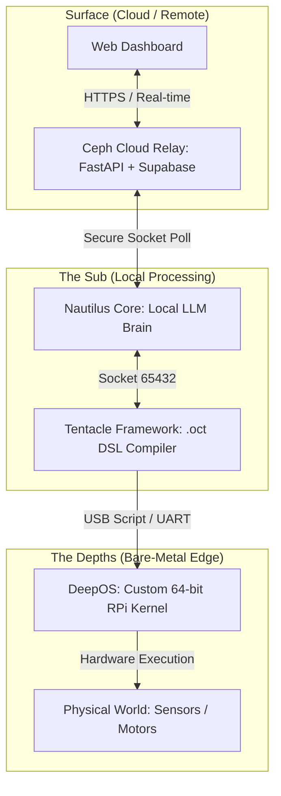

# 🌊 The Nautilus Initiative

> **"Bridging the depths of bare-metal silicon with the surface of the cloud."**

**N.A.U.T.I.L.U.S.** stands for **Network for Advanced Universal Technology, Innovation, Learning, and Uncharted Systems**

**The Nautilus Initiative** is a unified, end-to-end engineering ecosystem that merges custom bare-metal hardware orchestration, local artificial intelligence, dynamic plugin compilation, and secure cloud relays into a single, cohesive architecture.

Operating silently and efficiently—like its namesake—Nautilus is designed to be highly self-sufficient, privacy-focused, and infinitely extensible.

---

## 🏗️ Architectural Blueprint

The ecosystem is built on a vertical microkernel-style architecture, spanning four major layers of computing: Cloud, AI Core, Extensibility Bus, and Silicon.

---

## 🧩 The Ecosystem Modules

### 🔹 Module I: Nautilus Core *(formerly A.L.F.R.E.D)*

**The Autonomous Command Brain** A chat-based, responsive automation system running locally on Windows. It interprets natural language commands and executes system-level actions using local LLMs.

* **Tech Stack:** `Python 3.12`, `llama_cpp` (GGUF models), `speechRecognition`, `pyautogui`.
* **Status:** 🟢 **Active / Stable**
* **Key Features:**
* Fully offline LLM inference (OpenHermes, L3.1 Uncensored).
* Background hotkey execution (`launcher.pyw`).
* System manipulation and natural language parsing.

### 🔹 Module II: Ceph Cloud Relay

**The Secure Remote Interface** A high-performance, serverless command relay system that routes intents from a web dashboard to the local Nautilus Core without exposing local ports.

* **Tech Stack:** `FastAPI`, `Supabase` (Real-time Postgres), `Vercel`, `Pydantic`.
* **Status:** 🟢 **Active / Stable**
* **Key Features:**
* Serverless deployment with Mangum.
* Bcrypt security, rate limiting, and smart in-memory TTL caching.
* 3D interactive glassmorphism UI for remote control.

### 🔹 Module III: Tentacle Framework

**The Dynamic Expansion Bus** A custom domain-specific language (`.oct`) and compiler framework that injects new capabilities into Nautilus Core at runtime without altering main program logic.

* **Tech Stack:** `Python`, `pywebview` (GUI), Custom Socket Compiler.
* **Status:** 🟢 **Active / Stable**
* **Key Features:**
* Live Hot-Reloading via local TCP (`127.0.0.1:65432`).
* Visual IDE for writing, compiling, and deploying plugins.
* Seamless integration of Python scripts and LLM generation blocks.

### 🔹 Module IV: DeepOS

**The Bare-Metal Edge Controllers** Custom, scratch-built 64-bit operating systems for Raspberry Pi 3B+ and x86 Laptops, designed purely for low-level execution without commercial OS overhead.

* **Tech Stack:** `C`, `ARM64 Assembly`, Custom USB Host Stack (`dwc2`).
* **Status:** 🟡 **Active / Iterating**
* **Key Features:**
* Custom deterministic script parsing engine.
* Low-level hardware access (GPIO, HDMI Framebuffer).
* Standalone mass storage class driver for USB script ingestion.

### 🔹 Module V: Nautilus-HC *(Hardware Compiler)* **The Natural-Language-to-Silicon Bridge** An integrated compiler that translates high-level user intents directly into primitive bare-metal scripts, bridging the gap between Nautilus Core and DeepOS.

* **Tech Stack:** `Python`, `Tentacle Framework (.oct)`, `win32diskinterface`
* **Status:** 🛠️ **In Development**
* **Key Features:**
* Compiles natural language (e.g., *"strobe pin 7 infinitely"*) into raw `pin 7 inf > + 1000 - 1000` syntax.
* Automated USB drive detection and deployment.

---

## ⚙️ How It Works (The Command Lifecycle)

1. **Input:** You issue a command via Voice (locally) or via the **Ceph Cloud Relay** Web Dashboard from your phone.
2. **Processing:** **Nautilus Core** receives the text, processes it through the local `llama_cpp` engine to determine the intent, and extracts parameters.
3. **Routing:** If the command targets physical hardware, Core routes it to the **Tentacle Framework**.
4. **Compilation:** The in-development **Nautilus-HC** plugin intercepts the payload, transpiles the high-level intent into the bare-metal DSL, and quietly writes `script.txt` to an inserted USB drive.
5. **Execution:** You move the USB drive to the Raspberry Pi. **DeepOS** boots, reads the raw sectors via its custom USB driver, parses the syntax, and physically toggles the GPIO pins.

---

## 🛡️ Privacy & Philosophy

The Nautilus Initiative is built strictly on an **Offline-First, Privacy-Maximizing** ethos.

* **Zero Cloud AI:** All LLM inference is performed strictly on local silicon.
* **Isolated Execution:** Hardware logic is executed on detached bare-metal systems, rendering remote exploitation mathematically impossible once disconnected.
* **Modular Independence:** If the cloud relay goes down, the local brain functions perfectly. If the local brain is offline, the hardware continues its last known compiled loop.

---

*Developed & Maintained by Harshit*
